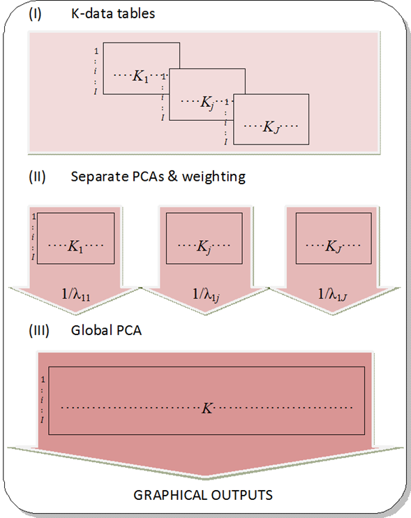
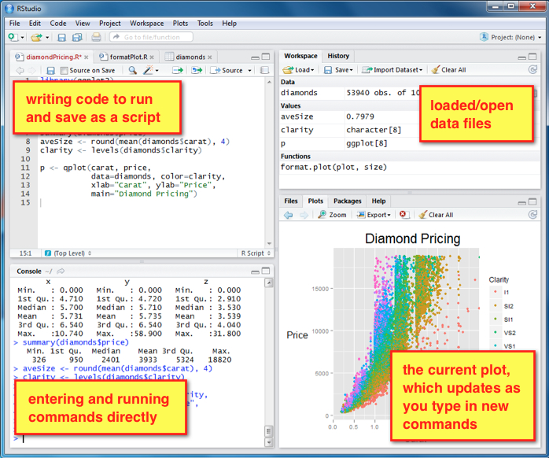

---
title: "A case study on obesity and metabolomic data analysis"
author: "Alex Sanchez-Pla, Toni Miñarro and Cristina Andres"
date: '2017-07-06'
output:
  html_document:
    theme: united
    toc: yes
---

```{r global_options, include=FALSE}
knitr::opts_chunk$set(fig.width=6, fig.height=4, fig.path='images/', warning=FALSE)
```

```{r results='asis', echo=FALSE, include=FALSE, eval=FALSE}
source("https://raw.githubusercontent.com/miriamMota/scripts/master/installifnot.R")
suppressPackageStartupMessages(installBiocifnot("limma"))
suppressPackageStartupMessages(installBiocifnot("genefilter"))
suppressPackageStartupMessages(installifnot("FactoMineR"))
suppressPackageStartupMessages(installifnot("mixOmics"))

```

# Introduction

These document contains a series of -simplified- analyses to illustrate a case study on the metabolomic analysis of obesity related data.

In its origin the goal of the study was to look for -metabolic- biomarkers that helped distinguish between diabetes/obesity related discordant phenotypes that is:

Diab. \ Obes | Non-Obese | Obese |
-------------|-----------|-------|
Non diabetes |Healthy&Lean|Healthy&Obese|
Diabetes     | Affected&Lean|Affected&Obese|
------------|-----------|-------|

<!--- 
For the sake of brevity in this lab we will only consider two groups: Obese and non-obese. 
--->

The lab will proceed in three parts which roughly reflect the real analyses performed on the data.

1. Exploratory Data Analysis (EDA) to aprehend the main trends of the data.
2. Building and validation of predictive models to distinguish Obese/Lean (or equivalently, Diab/Non-Diab or any of the four groups).
3. Correlation and Partial Correlation Analysis <!-- using Gaussian Graphical Models -->  to select metabolic and clinical related variables.

Each part relies on different statistical or Machine learning tools. Lack of space and time  makes it impossible to describe all techniques and tools with a minimum detail, so that a brief description and a couple references will be provided when they appear for the first time. Familiarity with these techniques as well as with the R statistical language is assumed.

# The data

The data for the analysis come from an untargetted metabolomics study on  discordant phenotypes as described above. For simplicity the data have been preprocessed apart and are provided as a binary R object. Data preprocessing has consisted of

- Cleaning 
- Normalization, using a log transform ("Pareto") method as described in  [https://bmcgenomics.biomedcentral.com/articles/10.1186/1471-2164-7-142](Centering, scaling, and transformations: improving the biological information content of metabolomics data).
- Imputation


```{r obData}
load("obesityData.Rda")
dim(obData)
colnames(obData)[c(1:10, 60:70)]
```

The dataset contains 3 types of variables

- Phenotypical data : Columns 1-5 (5)
- Clinical variables: 6-29 (29-6+1 = 24)
- *Medication variables: Not anymore. They have been removed for being almost constant*
- Metabolomic variables: 30-275 (275-30+1 = 246)

# Exploratory data analysis (EDA)

The initial exploration of the data can be done in different ways, either on a variable-at-a-time basis or looking at all variable simultaneously (using a multivariate approach), which we adopt here.

## Univariate biomarker selection

A first approach consists of looking for variables that take different values for different phenotypes. If this difference is clear, say statistically significant, these variables can be investigated as potential difference biomarkers.

For simplicity we subset metabolomic and clinical variables from the data

```{r}
if (! exists("obData")) load("obesityData.Rda")
xClin <- as.matrix(obData[,5:29]); dim(xClin)
xMetab <- as.matrix(obData[,30:275]); dim(xMetab)
YDisPhe <- as.factor(obData[,3]); 
YObes <- as.factor(obData[,1]) # Y is a factor, we chose it as the
YDiab <- as.factor(obData[,2]) # Y is a factor, we chose it as the
```
What clinical variables differ most between Obese and Thin?
We work with scaled variables to avoid differences due to distinct scale measures.

```{r}
scaledClin <-scale(xClin)
round(apply(scaledClin,2,mean),2)
round(apply(scaledClin,2,sd),2)
```
We do a ttest on a row-wise basis

```{r}
require(genefilter)
teststat <-rowttests(t(scaledClin), YObes)
head(teststat, n=25)
topDown<-order(teststat$p.value)
ranked<-teststat[topDown,]
print(top10<-ranked[1:10,])
```

And we visualize results in a volcano plot

```{r}
x<-ranked$dm; y<- -log(ranked$p.value)
plot(x, y, xlab="Fold Change", ylab ="-logPval", main="Volcano plot\nA vs B")
text (x[1:10], y[1:10],rownames(ranked)[1:10], cex=0.7)
```
Finally we want to be sure that the differences can be considered significant so we adjust p-values.

```{r}
adjP <- p.adjust(ranked$p.value)
ranked <- cbind(ranked, adjP)
print(ranked[1:20,])

```

We see that when we adjust p-values only a few variables are significant.

### Exercise 0

Adapt the previous calculations to select metabolites that have significantly distinct values between obese and thin individuals.

## Multivariate analysis

We will use *Multiple Factor Analysis*, a dimension reduction method particularly well suited for datasets where variables are structured in groups. It is then a natural option when we wish to simultaneously study several groups of related variables (continuous or categorical).

MFA allows us to study the similarities between individuals with respect to all variables as well as studying the linear relationships between variables, all this by taking into account the structure of the data (balancing the influence of each group).

For further information on MFA, see the following papers:

- [http://factominer.free.fr/docs/PagesAFM.pdf](Multiple Factor Analysis: main features and application to sensory data)
- [http://factominer.free.fr](The website, with documents, examples and code)

Performing a MFA for a single group is equivalent to the popular *Principal Components Analysis* method. When there are several groups we can think of it as a two-step PCA. First separate PCAs are performed for each group of variables. Each dataset is then weighted by the inverse of the largest eigenvalue obtained in the analysis and a new PCA is performed with all the data.




We start with separate analysis on clinical and metabolomic data.
The following code performs MFA on the dataset formed by the clinical variables. The variable described the phenotypes, as well as sex and age are treated as supplementary.

The meaning of the arguments is:

- `base`: the data set used: a data frame with n rows (individuals) and p columns (variables)
- `group`: a vector indicating the number of variables in each group
- `type`: the type of the variables in each group. "s" for scaled continuous variables, "c" for centered (unscaled) continuous variables and "n" for categorical variables
- `ncp`: number of dimensions kept in the result
- `name.group`: names of the groups
- `num.group.sup`: indexes of the supplementary groups

```{r clinical}
require(FactoMineR)
clin.mfa <- MFA(base = obData[,1:29], group=c(4, 25), type=c("n","s"),
                ncp=4,name.group=c("pheno","clin"), graph=FALSE,
                num.group.sup=NULL)
```

As most dimension reduction methods MFA provides a series of plots that help interpret the results.
```{r}
barplot(clin.mfa$eig[,1],main="Eigenvalues",names.arg=1:nrow(clin.mfa$eig))
plot.MFA(x= clin.mfa, choix="axes", habillage="group")
plot.MFA(x= clin.mfa, invisible="quali", choix="ind", habillage="Fen_Group")
plot.MFA(clin.mfa, invisible="ind", partial="all", habillage="Fen_Group")
plot.MFA(clin.mfa, choix="var", habillage="group")
# plotellipses(clin.mfa, habillage="Fen_Group", keepvar = "quali.sup" )
```

### Exercise 1

Adapt the code above to run a MFA for the metabolic variables.


## Joint analysis of Clinical and Metabolomic data

If one visually compares the individual plots from clinical and metabollomics data it is very clear that clinical variables separate well the 4 groups whilst metabolomic do a worse job.

One could ask if combining both datasets can give better results, or at least improve the poorer results of metabollomic data.

Below are shown the joint analyses of clinical and metabolomic data and it can be seen that the increase in number of variables only implies a decrease in global explanation of variability but, in any case, a better separation is observed.

```{r}
res.mfa <- MFA(base = obData, group=c(4, 25, 246), type=c("n",rep("s",2)),
               ncp=5, name.group=c("pheno","clin","metab"), 
               graph=FALSE, num.group.sup=c(1))

plot.MFA(x= res.mfa, choix="axes", habillage="group")
plot.MFA(x= res.mfa, invisible="quali", choix="ind", habillage="Fen_Group")
plot.MFA(res.mfa, invisible="ind", partial="all", habillage="Fen_Group")
plot.MFA(res.mfa, choix="var", habillage="group",  lim.cos2.var=0.51)
plotellipses(res.mfa, habillage="Fen_Group", keepvar = "quali.sup" )
```


# Appendix: R crash session

This lab session is intended to be run in R, but *it might be the case* that you are not familiar with R. As any other language, R cannot be taught in a few minutes, nut here are some survival tips that may help you go through the session (and survive until you arrive home and start seriously learning it :-))

- R is described as a "free software environment for statistical computing and graphics". 
- It may be run from a raw console, from a neater graphical interface ("Rstudio") or even from statistical-packages-like environments such as "R-commander". We assume you are using Rstudio here.
The image below shows an outline of the distinct Rstudio regions



- R works by manipulating *objects*, which may be variables, datasets (here called "data.frames") but also things like lists, results or simply graphs.
- Using R is usually done by means of *commands*. Most of them consist of *assignments* made using the `<-` operator. These can be of many types
    + Assigning a value or the result of an operation to a variable.
    + Assigning the result of invoking a function
    + Subsetting an object
    + Calling a function whose output will be shown in the console or as a plot.
    
```{r examples1}
x<- 3; y<- 1:10; show(x); show(y)
z<- rnorm(100)
hist(z)
```

See [http://heather.cs.ucdavis.edu/~matloff/r.old.html](this tutorial) for two short 5 min sessions, and much more...

