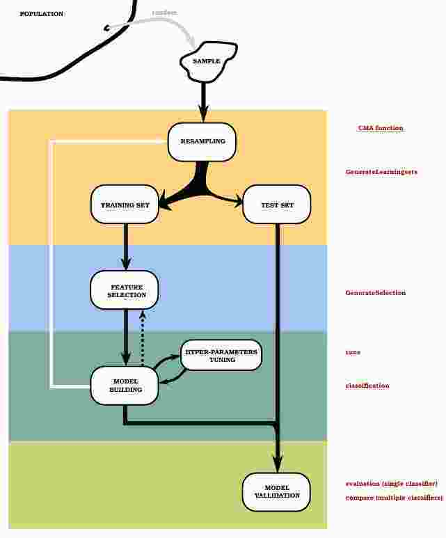
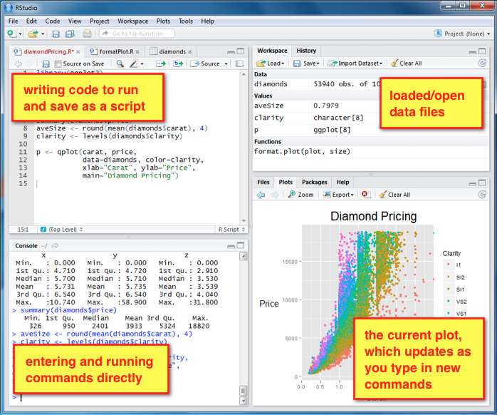

---
title: "A case study on obesity and metabolomic data analysis"
author: "Alex Sanchez-Pla, Toni Miarro and Cristina Andres"
date: '2017-07-06'
output:
  html_document:
    theme: united
    toc: yes
---

```{r global_options, include=FALSE}
knitr::opts_chunk$set(fig.width=6, fig.height=4, fig.path='images/', warning=FALSE)
```

```{r results='asis', echo=FALSE, include=FALSE, eval=FALSE}
source("https://raw.githubusercontent.com/miriamMota/scripts/master/installifnot.R")
installifnot<- function(pckgName){
  if (!(require(pckgName, character.only = TRUE))) {
    install.packages(pckgName, dep = TRUE)
    require(pckgName)
  }
}
suppressPackageStartupMessages(installifnot("FactoMineR"))
suppressPackageStartupMessages(installifnot("mixOmics"))
suppressPackageStartupMessages(installBiocifnot("limma"))
```

# Introduction

These document contains a series of -simplified- analyses to illustrate a case study on the metabolomic analysis of obesity related data.

In its origin the goal of the study was to look for -metabolic- biomarkers that helped distinguish between diabetes/obesity related discordant phenotypes that is:

Diab. \ Obes | Non-Obese | Obese |
-------------|-----------|-------|
Non diabetes |Healthy&Lean|Healthy&Obese|
Diabetes     | Affected&Lean|Affected&Obese|
------------|-----------|-------|

<!--- 
For the sake of brevity in this lab we will only consider two groups: Obese and non-obese. 
--->

The lab will proceed in three parts which roughly reflect the real analyses performed on the data.

1. Exploratory Data Analysis (EDA) to aprehend the main trends of the data.
2. Building and validation of predictive models to distinguish Obese/Lean (or equivalently, Diab/Non-Diab or any of the four groups).
3. Correlation and Partial Correlation Analysis <!-- using Gaussian Graphical Models -->  to select metabolic and clinical related variables.

Each part relies on different statistical or Machine learning tools. Lack of space and time  makes it impossible to describe all techniques and tools with a minimum detail, so that a brief description and a couple references will be provided when they appear for the first time. Familiarity with these techniques as well as with the R statistical language is assumed.

# The data

The data for the analysis come from an untargetted metabolomics study on  discordant phenotypes as described above. For simplicity the data have been preprocessed apart and are provided as a binary R object. Data preprocessing has consisted of

- Cleaning 
- Normalization, using a log transform ("Pareto") method as described in  [https://bmcgenomics.biomedcentral.com/articles/10.1186/1471-2164-7-142](Centering, scaling, and transformations: improving the biological information content of metabolomics data).
- Imputation


```{r obData}
load("obesityData.Rda")
dim(obData)
colnames(obData)[c(1:10, 60:70)]
```

The dataset contains 3 types of variables

- Phenotypical data : Columns 1-5 (5)
- Clinical variables: 6-29 (29-6+1 = 24)
- *Medication variables: Not anymore. They have been removed for being almost constant*
- Metabolomic variables: 30-275 (275-30+1 = 246)


# Class prediction

One of the main goals of this study was trying to find one or more variables, preferably of metabolomic nature, that could be used to classify the phenotype of individuals as belonging to any of the four classes described (`HT`, `HO`, `DT`, `DO`) and predict to which group a new individual belongs. 

This is a common problem in data science and is generally described as the problem of *building and validating* classifiers. In biomedicine, nutrition or bioinformatics the term classifiers is often changed by its, roughly equivalent, of "biomarkers". 

Ilustration 1 below ("workflow") illustrates the basics blocks on which the biomarker discovery process can be arbitrarily divided.


Illustration figure 2 ("validation") illustrates how to use cross-validation to build and validate a biomarker in such a way that unbiased estimates of generalization error can be obtained.




For this exercise we will consider two distinct set of predictors: clinical and metabolomic data and three possible classifications, the most ambitious, made of four groups and two simplified versions of it.

```{r data4classif}
if (! exists("obData")) load("obesityData.Rda")
xClin <- as.matrix(obData[,5:29]); dim(xClin)
xMetab <- as.matrix(obData[,30:275]); dim(xMetab)
YDisPhe <- as.factor(obData[,3]); 
YObes <- as.factor(obData[,1]) # Y is a factor, we chose it as the
YDiab <- as.factor(obData[,2]) # Y is a factor, we chose it as the
(tabDisPhe<- table(YObes, YDiab))
margin.table((tabDisPhe),1)
margin.table((tabDisPhe),2)
```                                              

## Classification and prediction with R

There are many packages in `R` to apply each of the many available
classification methods.  Some of them such as `caret`, `CMA` or
`MLtools` also support the process of
building and validating a classifier based on testing a set of
different approaches on a set of samples using an appropriate
cross-validation approach. 

Here we will use `mixOmics` package. Although this package is not specifically designed for classification but for the integrative analysis of omics data it has the advantage that we can use it for other things in the lab.


## Methods available for class prediction

We will use the `PLS-DA` method or its sparse variant `sPLS-DA` to (try to) classify the individuals according to their phenotypes.

PLS-DA is a classical PLS regression (with a regression mode) but where the response variable is categorical. i.e. indicates the classes/categories of the samples. PLS-DA has often been used for classification and discrimination problems (i.e. supervised classification), even though PLS was not originally designed for this purpose. The response vector Y is qualitative and is recoded as a dummy block matrix where each of the response categories are coded via an indicator variable. PLS-DA is then run as if Y was a continuous matrix. 

The parameters to choose by the user here is the number of components or dimensions ncomp, it is usually set to k -1 where k is the number of classes.

sPLS-DA is based on the same concept as sPLS to allow variable selection, except that this time, the variables are only selected in the X data set and in a supervised framework, i.e. we are selecting the X-variables with respect to different categories of the samples.

The parameters to choose by the user here is the number of components or dimensions `ncomp` and the number of variables to choose in the X dataset `keepX`.


```{r}
require(mixOmics)
resClinDisPhe <- splsda(xClin, YDisPhe, ncomp = 3, keepX = c(10, 10, 10)) 
# where keepX is the number of variables selected for each components
# where ncomp is the number of components wanted
```

Information can be extracted from the object that is obtained by calling the `splsda` function. This allows for instance to visualize the individuals in the space spanned by the first two components.

```{r}
plotIndiv(resClinDisPhe, ind.names = YDisPhe, add.legend = TRUE, plot.ellipse =TRUE)
```
The variables selected have a different "role" in each component (components are orthogonal, that is each explains a different dimension on which the data vary).


```{r}
selectVar(resClinDisPhe, comp = 1)
selectVar(resClinDisPhe, comp = 2)
```

## Classification accuracy

Most methods applied on a dataset will be able to produce a predictive model. What is important is *how good* this model is, or *how better* than alternative ones it can be considered to be.

The `perf` (for "performance") function allows to estimate the classification error rate using cross-validation. 

```{r}
set.seed(45)
errClinDisPhe <- perf(resClinDisPhe, validation = "Mfold", folds = 8,dist = "centroids", progressBar = FALSE)
errClinDisPhe$error.rate
errClinDisPhe$error.rate.class
plot(errClinDisPhe, type = "l")
```

## Exercise 2

- Adapt the previous code to build a predictive model based on metabolomic variables.
- Which of both models would you consider preferable? Answer this question before and after doing the exercise.

## Class prediction for new samples

With (s)PLS-DA, the classes of new samples or observations can be predicted in the model by using the `predict` function. 

The code below shows an example to perform 3-fold cross-validation. Normally 10-fold cross-validation should be performed several times and the results should be averaged to get a better estimation of the generalization performance:

```{r}
X <- as.matrix(xClin)
Y <- YDisPhe
i <- 1
samp <- sample(1:3, nrow(X), replace = TRUE) 

test <- which(samp == i) # Search which column in samp has a value of 1
train <- setdiff(1:nrow(X), test) # Keeping the column that are not in test

splsda.train <- splsda(X[train, ], Y[train], ncomp = 3, keepX = c(10, 10, 10))
newClass <- predict(splsda.train, X[test, ], method = "max.dist")
# newClass$class
(Prediction1 <- newClass$class$max.dist[, 1])
(Prediction2 <- newClass$class$max.dist[, 2])
Original <- as.character(YDisPhe[test])
cbind(Original, Prediction1, Prediction2)
```

## Exercise 3

- Compute an estimate of the misclassification error rate from the previous computations.
- How could this error rate be improved?

# Relating clinical and metabolomic data

There are different approaches for studying the predictive ability of metabolic markers, which, as we have seen, can be worse predictors of health state than clinical variables.

Instead of building predictive models we can look for which variables of each group are related to which variables of the other in an attempt to simplify the scenario.

For this we will use Canoncial Correlation Analysis,

## The data for the CCA analysis

```{r data4CCA}
if (! exists("obData")) load("obesityData.Rda")
xClin <- as.matrix(obData[,5:29]); dim(xClin)
xMetab <- as.matrix(obData[,30:275]); dim(xMetab)
YDisPhe <- as.factor(obData[,3]); 
YObes <- as.factor(obData[,1]) # Y is a factor, we chose it as the
YDiab <- as.factor(obData[,2]) # Y is a factor, we chose it as the
```                                              


## Canonical and regularized Canonical Correlation Analysis

Canonical Correlation Analysis (CCA) is a multivariate exploratory approach to highlight correlation between two data sets acquired on the same experimental units. In the same vein as PCA, CCA seeks for linear combinations of the variables (called canonical variates to reduce the dimension of the data sets, but this time while trying to **maximize the correlation** between the two variates (the canonical correlation).

Similar to PCA, the user has to choose the number of canonical variates pair (ncomp) to summarize as much information as possible.

Classical CCA assumes that p < n and q < n , where p and q are the number of variables in each set. In the high dimensional setting usually encountered with biological data, where p + q >> n + 1, CCA cannot be performed.

Instead **Regularized Canonical Correlation Analysis** is proposed. Regularization means to perturbe the empirical covariances matrices of X and Y by adding a multiple of the matrix identity (Id): Cov(X) + 位1Id and Cov(Y) + 位2Id.


In addition to the number of dimensions ncomp to choose, in rCCA, the two parameters to tune are therefore the regularization (or l2 penalties) 位1 and 位2. 

In mixOmics this is done using cross-validation with the function estim.regul (see below). Note that these two parameters remain unchanged for all dimensions of rCCA. This tuning step may take some computation time.

## Exploring correlations

Before we go into rCCA we can explore the simple bivariate correlations between any pairs of variable types. `mixOmics` proposes two ways to obtain this kind of representation, with either the expansion of the three correlation matrices or with the whole concatenated matrix X and Y

We start with a toy example.

```{r}
X <- as.matrix(xClin)
Y <- as.matrix(xMetab)
icSep<- imgCor(X[1:4,1:3], Y[1:4, 1:3], type="separate", interactive=FALSE)
```

And then repeat this for the whole dataset

```{r}
icSep<- imgCor(X, Y, type="separate", interactive=FALSE)
```

## Tuning the method

rCCA depends on two parameters. The question of which values they should be given is not trivial. A standard approach is to select them using crossvalidation by testing their values on a grid of possible values.

```{r paramTuning, eval=FALSE}
grid1 <- seq(0.01, 3, length = 30)
grid2 <- seq(0.01, 0.1, length = 50)
## Depending on how fine your grid is, estim.regul may take some time
cv.score <- tune.rcc(X, Y, grid1=grid1, grid2=grid2)
# This call provides the following values
# lambda1 =  0.205 
# lambda2 =  0.05573469 
# CV-score =  0.5427141 
save(cv.score, file= "cv.score.Rdata")
``` 

Once the regularization parameters are chosen, we can call the rcc
function with the appropriate values for the parameters $\l1$ and
$\l2$.

```{r runCCA, eval=FALSE}
## Run rCCA given the optimal parameters:
lambda1 =  0.205 # cv.score$opt.lambda1
lambda2 =  0.05573469 # cv.score$opt.lambda2
result <- rcc(X, Y, ncomp = 3, lambda1 = lambda1, lambda2 = lambda2)
```

An alternative approach, useful for the case where the parameters could not be estimated is to use a shrinkage method to bypass this tuning step. This is what will be done in this lab.

```{r runShrinkedCCA}
## Run rCCA using the Shrinkage method:
result <- rcc(X, Y, ncomp = 3, method="shrinkage")
```

A scree plot is useful to help choosing the number of the rCCA dimensions:
```{r}
plot(result, scree.type = "barplot")
```

## Describing the results

rCCA allows for a variety of graphical representations.
Some of them are relatively similar to those provided by MFA so we will skip it in this short lab.

You can go through these by uncommenting the code.

### Samples Representation

In this plot the samples are represented as point placed according to
their relation to two dimensions among those chosen in the analysis.
Such points tends to aggregate together when they are share
similarities.

```{r samplesPlot, eval=FALSE}
indNames <- rownames(X)
groups <- YDisPhe
col.groups <-as.numeric(groups)
plotIndiv(result, comp = 1:2, col = col.groups, cex=0.8)
```

### Variables Representation

In this type of graphical display, the variables X and Y are
represented through their projections onto the plane defined either by X-variates or Y-variates. 

The variables X and Y being assumed to be of unit variance, their projections are inside a circle of radius 1 centered at the origin called correlation circle. 

The interpretation of this plot will be based on the following two ideas:

-  Strongly associated (or correlated) variables are projected in the same direction from the origin. 
- The greater the distance from the origin the stronger the association. 


In order to facilitate visualization it can be allowed that only those variables with a correlation above a given threshold are shown in the plot. The two plots shown have been drawn using cutoff values of 0.95 and 0.90 respectively

Two circumferences of radius 1
and 0.5 are plotted to reveal the correlation structure of the
variables.


```{r plotVar, eval=FALSE}
plotVar(result, comp = 1:2, cutoff=0.5, cex = c(0.8, 0.8), rad.in = 0.1)
# plotVar(result, comp = 1:2, cutoff=0.90, X.label=TRUE, Y.label=TRUE, cex = c(0.8, 0.8))
# plot3dVar(result, cutoff = 0.6, cex = c(1.5, 1.5), label.axes.box = "axes")
```

### Relevance networks

Relevance networks are intended to focus on the relationship between the two types of variables. That is they allow to highlight high correlations between elements of the two types of variables.


```{r relNetwork, eval=FALSE}
# The user can set a correlation threshold to only represent variables above that threshold
network(result, comp = 1:3, interactive = FALSE, cutoff = 0.5)
``` 


# Appendix: R crash session

This lab session is intended to be run in R, but *it might be the case* that you are not familiar with R. As any other language, R cannot be taught in a few minutes, nut here are some survival tips that may help you go through the session (and survive until you arrive home and start seriously learning it :-))

- R is described as a "free software environment for statistical computing and graphics". 
- It may be run from a raw console, from a neater graphical interface ("Rstudio") or even from statistical-packages-like environments such as "R-commander". We assume you are using Rstudio here.
The image below shows an outline of the distinct Rstudio regions



- R works by manipulating *objects*, which may be variables, datasets (here called "data.frames") but also things like lists, results or simply graphs.
- Using R is usually done by means of *commands*. Most of them consist of *assignments* made using the `<-` operator. These can be of many types
    + Assigning a value or the result of an operation to a variable.
    + Assigning the result of invoking a function
    + Subsetting an object
    + Calling a function whose output will be shown in the console or as a plot.
    
```{r examples1}
x<- 3; y<- 1:10; show(x); show(y)
z<- rnorm(100)
hist(z)
```

See [http://heather.cs.ucdavis.edu/~matloff/r.old.html](this tutorial) for two short 5 min sessions, and much more...

